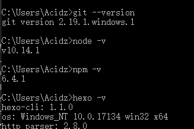

# hexo + github 搭建自己的个人博客

俗话说人人都有一颗搭博客的心，直到前段时间再次看到一篇名为<<使用hexo+github搭建免费个人博客详细教程>>的文章。

<!-- more -->

> ## 闲聊在前

读完开头提到的文章，我并没有马上开始实操，而是又去收集了很多相关的文章，这些文章对我都有帮助，他们的链接我将会在最后列出。读完这些文章理清了很多一开始的认知误区和迷糊的地方，也希望给你更好的启发。
如果你下定决心了，那么，我首先要告诉你的是搭建博客的途径，我觉得这很重要，能让你不受局限于本文而选择适合自己的方式。

一般来说有三种方式:
1. 基于Wordpress等一站式解决方案(小白首选)
2. 基于静态页面+博客框架(如github pages + hexo)
3. 全面的前后端知识亲手搭建

本文属于第二种情况，如果你选择这种方式那么你需要开始折腾了。知道这一点后我还要告诉你的是下面的内容，关于我刚搭建完博客后的见解。

我把整个过程大致分成两个阶段。第一步先利用hexo搭建一个本地个人博客，第二步利用github让别人也看到你的博客。

关于第一步:

hexo是一个优秀的博客框架(不局限于此)，你只需要在电脑上某处新建一个文件夹，便可以利用hexo帮你搭建属于你的个人博客，当然完事以后这个博客只是躺在你的电脑上而已。除了hexo以外还有别的框架可以供选择，这些框架你可以在我提供的文章链接或别处了解到。另外有趣的是hexo的官网上有这么一段主题叫做 _[迁移](https://hexo.io/zh-cn/docs/migration)_ 的内容，将告诉你怎么将自己在别处的博客全部转移到hexo框架下。

关于第二步:

如果你已经注册了github帐号，那么恭喜你!关于什么是github pages你可以先了解一下，也可以在文末的引用中找到我看过的一篇。简单的说就是要在github上新建一个仓库，仓库的名字很特别，然后在你的本地博客的配置文件中写上这个仓库的地址，最后只需要敲 `hexo deploy` 就可以将博客发布，让别人看到你的博客。事实上就是git帮你自动同步到你新建的仓库，浏览器输入仓库名就可以访问了。当然，这听起来非常的掉价，那么你可以给这个仓库改头换面，弄一个个性化域名。反正我觉得这无所谓，不过别着急后面会告诉你的。

>> 重要:除了github平台，还有其他平台可供选择，比如国内的码云。需要注意的是，在访问速度方面，国内的肯定是要比国外快的。

小结:如果你已经大概清楚这两步你要干什么了，相信我，完全可以跳过准备工作。事实上准备工作的部分被我删掉了，因为我觉得没必要单独说明。

> ## Hexo搭建博客(第一步)

如果第一次使用hexo，那么最好的方式当然是从 [官网的Getting Started](https://hexo.io/docs/) 开始入手。hexo官网支持很多语种，你可以切换到中文。到这里，你一定发现了除了文字教程以外，还有来自b站的视频可供你学习。无论通过何种方式下面你都可以开始搭建博客了，下面我按官网 __开始使用__ 中的目录结构来说一下我的经验。

* 概述 

    这里会告诉你使用hexo前你应该安装好Git和Node.js，当然没有也没关系，因为它会告诉你怎么做。Node.js是hexo需要依赖的环境，而Git在建站的时候你就会知道他有什么用了。Git和Node。js的安装可以安装win系统熟悉的方式下载安装包安装，而Hexo可以通过git bash中输入命令的方式安装。
    ``` bash
    $ npm install -g hexo-cli
    ```
    全都安装完了以后，建议在cmd或者git bash中查看一下版本，这么做主要是为了确认这些都正确安装了。

    

* 建站
    
    官方一上来就给了三条命令:
    ``` bash
    $ hexo init <folder>
    $ cd <folder>
    $ npm install
    ```
    第一条命令中 < folder > 需要替换成一个文件夹名字，即使这个文件夹不存在也没有关系会主动创建。如果不写，则被hexo认为指代当前文件夹。然后hexo会初始化这个文件夹，在文件夹中生成对应的结构。其实你观察输出语句就会发现，初始化就是利用Git去克隆了一个远程仓库(默认主题的博客站)。其中会夹杂一下WARN但是没有关系，最后是一句INFO  Start blogging with Hexo!到这里你的博客其实就诞生了，后续你只用装修而已。后两条命令就是进入这个文件夹并安装一些东西。

    所以你会发现，如果你是随手在某处打开git bash的话，你的博客就随便安了家。但是没有关系，你可以 ctrl+x 给它找个好地方，记得重新打开git bash。
    
* 配置

    这个文件_config.yml中可以进行很多配置，也就是相当于你的装修清单(主题也包含一个这样的文件用于主题配置)，以后你会花费一些时间在这些地方。值得注意的是yml文件的书写格式。

* 命令

    这里官方介绍了一部分主要命令。你会好奇，自己用了三条命令就搭好了博客，难道只能在文件夹里看到它么，甚至不知道它长什么样子，那么再敲两条命令你就可以看到它了。
    ``` bash
    hexo generate  //生产静态文件
    hexo server    //启动服务
    ```

    然后你就可以打开浏览器输入他给你的地址了http://localhost:4000
    然后便是你第一次看到你的博客，默认使用的主题是landscape，虽然有点丑但也是很开心的。有时候会遇到4000端口被占用而启动失败，那么只需要换个没占用的端口就好了，拿5000举个例子
    ``` bash
    hexo server -p 5000
    ```

> ## 让大家看到我的博客(第二步)

如果你没有注册过github帐号和使用过仓库的话，那么需要注册一个帐号，然后配置SSH KEY，又到了自己动手(百度)，丰衣足食的时候了。

当你准备好了以后，可以在自己的github上新建一个仓库，这个仓库的名字必须是这样的格式`username.github.io`，如果你已经知道了什么是User Pages的话，想必就明白了。不知道也没有关系，只要确保username是你github帐号的用户名就好了。提示:新建完仓库在cmd或git bash中输入ping username.github.io是可以ping通的。

1. 修改_config.yml

    打开配置文件，找到deploy，然后把它修改正确。
    ``` yaml
    # Deployment
    ## Docs: https://hexo.io/docs/deployment.html
    deploy:
        type: git
        repo: git@github.com:username/username.github.io.git        //换成你自己的仓库
        branch: master
    ```
    将repo换成你自己的仓库地址后，保存。

2. 发布

    在git bash中输入最后一条命令
    ``` bash
    hexo deploy     //发布到指定的仓库
    ```

    如果之前使用`hexo server`命令启动服务还没有停止，记得先 `ctrl + c`停止服务。然后再输入上面的命令，那么这个仓库的GitHub Pages设置会自动设置好，别的文章都是手动去设置，这里提出来，并不是为了有所对比，而是当一切都不顺利的时候，希望你有思路去解决。事实上，发布就是利用Git将静态页面以及样式等同步到github仓库。

    此时你在浏览器就可以直接输入`username.github.io`来访问你的博客了。

> ## 两点补充

* 个性化域名

    关于如何通过个性化域名访问自己的博客，很多文章里都有细致讲解，包括我引用的文章。你需要做的并不多，购买一个域名，进行相关设置。

* 博客主题

    默认的博客主题是landscape，如果你想立刻马上换一个主题，那么我支持你!
    1. 首先，你需要去Hexo官网的 [Themes](https://hexo.io/themes/) 模块找到一个你喜欢的主题。虽然它的排序方式是以英文字母顺序来的，没有排行榜，目前比较受欢迎的主题有NexT，也是我选用的主题。

    2. 其次，每一个主题都对应一个github仓库，预览主题时你一定能找到指引你去仓库的方式。拿到仓库地址后你只需要将它克隆到本地来。如果你还记得你的博客的目录结构的话，你会发现有一个themes文件夹，打开文件夹后你会看到这里面只有一个文件夹那就是landscape，在这里打开一个git bash将你喜欢的主题仓库克隆下来。
    ``` bash
    $ git clone git@github.com:theme-next/hexo-theme-next.git       //以NexT主题为例
    ```

    3. 最后，如果想让这个主题生效，那么就需要在你的装修清单_config.yml中修改主题。
    ``` yaml
    # Extensions
    ## Plugins: https://hexo.io/plugins/
    ## Themes: https://hexo.io/themes/
       theme: next     //默认是landscape，直接修改即可，名称与themes文件夹下主题文件夹同名
    ```
    重新发布博客。
    ``` bash
    $ hexo clean        //清除
    $ hexo generate     //重新生成静态页面
    $ hexo deploy       //发布
    ```
    重新在浏览器访问博客，验证是否生效。

> ## 总结在后

啰嗦两句，都说越新的手子字越多，看来的确是这样。第一次写博客，感觉自己的思路很乱，想尽可能的写的细致，让小白也能看得懂，但是怎么也做不到。后来一想，小白已经被我推荐到第一种方式了，留下来的估计都是狠角色，自己倒腾倒腾也就整出来了，也就放心多了。

也不知道自己的文章是什么样的风格，不过搭建一个博客主要也是为了学习，或是总结经验。没打算有人会看得见它，所以又放心了。如果很幸运文章被你看到了，那希望对你是有益的。但如果你发现我哪里写的有问题，记得一定要大声告诉我，欢迎指正。

> ## 引用&感谢

以下无先后顺序，无主观评价，感谢前人种树

* 整理的时候发现我好像在"抄袭并翻译"这个大佬，另外这个大佬的文末推荐的文章挺好的

    [https://blog.csdn.net/peterzhen40/article/details/78942293](https://blog.csdn.net/peterzhen40/article/details/78942293)

* github pages的两种类型

    [https://www.cnblogs.com/liuzhi/p/8169255.html](https://www.cnblogs.com/liuzhi/p/8169255.html)

* 本文开头提及的文章

    [https://mp.weixin.qq.com/s/qfytH4TsM0bDEt99X-Ztbw](https://mp.weixin.qq.com/s/qfytH4TsM0bDEt99X-Ztbw)

* 中途学习了一下markdown语法

    [https://www.cnblogs.com/liugang-vip/p/6337580.html](https://www.cnblogs.com/liugang-vip/p/6337580.html)

* 讲的比较细的一篇文章

    [https://blog.csdn.net/gdutxiaoxu/article/details/53576018](https://blog.csdn.net/gdutxiaoxu/article/details/53576018)


