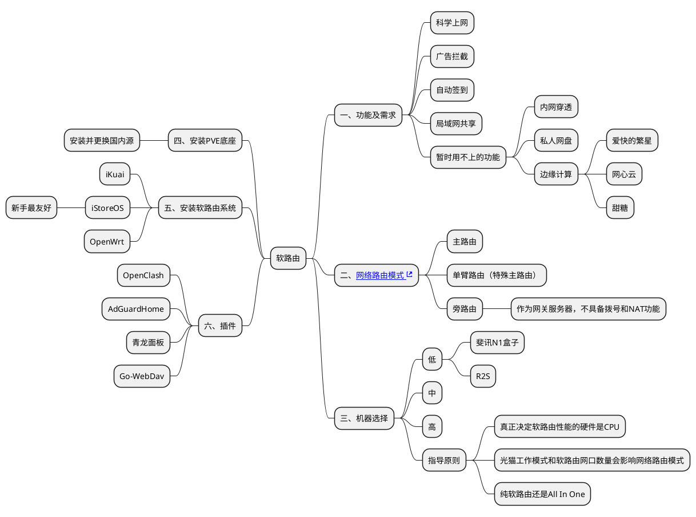

# 软路由

以“**生命不息 折腾不止**”为原则进行软路由探索学习。

> 关联话题

- 虚拟化：PVE、EXSI等
- NAS
- All In One

> 最终方案

- 直接选择旁路由模式，最简单，只需要部署一个路由系统即可，那么当然是新手最友好的 iStoreOS 了
- 机器直接用的手上吃灰的NUC8，一个网口正适合旁路由
- 虽然只是折腾软路由，但还是先在机器上安装PVE然后再装iStoreOS，正好熟悉下PVE
- 装PVE不需要重做U盘，实测用Ventoy就可以

## 安装PVE底座

PVE官网下载最新版ISO镜像放到Ventoy中，插到机器上开机从Ventoy启动选择PVE ISO开始安装，参考《[超详细，多图，PVE安装以及简单设置教程(个人记录)][1]》。安装后更换国内源还可以参考《[PVE 8.0国内源及优化][2]》、《[pvetools][3]》。

## 安装iStoreOS

这个直接参考官方《[X86 PVE 安装][4]》

## 安装插件

除了iStore商店的插件，开源的参考《[Are-u-ok][5]》。

### OpenClash

怎么用上网学习，没看到很好的文章。

常用公共dns地址：

223.5.5.5 阿里云
114.114.114.114 114
119.29.29.29 腾讯
180.76.76.76 百度
8.8.8.8 谷歌
1.1.1.1 cloudflare

### AdGuardHome

参考《[OpenWrt 保姆级AdGuard Home 设置广告拦截＆加快DNS解析网页秒开][6]》、《[浅谈OpenClash与ADGuard Home的组合][7]》

打开 https://checkadblock.ru/ 测试一下过滤效果，因为是国外的只能做参考

### 青龙面板

按照《[qinglong][12]》docker方式安装命令在iStore里面终端用docker命令装，安装完以后访问面板会进行初始化设置，参考《[青龙面板消息推送功能设置之钉钉机器人消息推送！][8]》，然后探索一些好玩的东西《[青龙面板实现京东、阿里云盘、glados等自动签到][9]》、《[2023最新青龙面板京东脚本库][10]》

需要注意的是，面板初始化配置的通知是在登录面板时发送一个登录通知。想要配置任务执行完后的通知，需要修改配置文件内容，同时任务脚本代码中要支持

### Go-WebDav

参考官方《[WebDav共享][11]》

## OpenClash+AdGuardHome
oc：

1. 配置机场订阅
1. 全局设置-模式设置：Fake-IP混合模式，仅代理命中流量
1. 全局设置-DNS设置：取消本地DNS劫持，自定义上游DNS服务器，禁止Dnsmasq缓存DNS

adh：

1. 更新核心
1. 配置端口，重定向（使用53端口替换dnsmasq）
1. 打开网页管理页面，设置-dns设置
   - 上游dns服务器设置为openclash的地址127.0.0.1:7874
   - Bootstrap DNS服务器设置为公共dns即可
   - 限速、缓存可按需设置
2. 过滤器-DNS黑名单

## 做个记录避免找不到入口

- PVE面板 https://192.168.1.120:8006/
- iStoreOS http://192.168.1.122/
- OpenClash从iStore可以进
- AdGuardHome从iStore可以进
- 青龙面板 http://192.168.1.122:5700/login
- Go-WebDav从iStore可以进

[1]: https://post.smzdm.com/p/agqw24zw/
[2]: https://kzpu.com/archives/5448.html
[3]: https://github.com/ivanhao/pvetools
[4]: https://doc.linkease.com/zh/guide/istoreos/install_pve.html
[5]: https://github.com/AUK9527/Are-u-ok
[6]: https://www.yitoujing.com/article/36
[7]: https://lrt666.top/posts/5246fadb.html
[8]: https://www.feiji.work/2021/411.html
[9]: https://www.pangzhai.xyz/docker_qinglong/
[10]: https://conveniencespace.com/index.php/2022/05/03/2022%E6%9C%80%E6%96%B0%E9%9D%92%E9%BE%99%E9%9D%A2%E6%9D%BF%E4%BA%AC%E4%B8%9C%E8%84%9A%E6%9C%AC%E5%BA%93%EF%BC%88%E6%8C%81%E7%BB%AD%E6%9B%B4%E6%96%B0%E4%B8%AD%EF%BC%89/
[11]: https://doc.linkease.com/zh/guide/easepi/common.html#webdav%E5%85%B1%E4%BA%AB
[12]: https://github.com/whyour/qinglong
