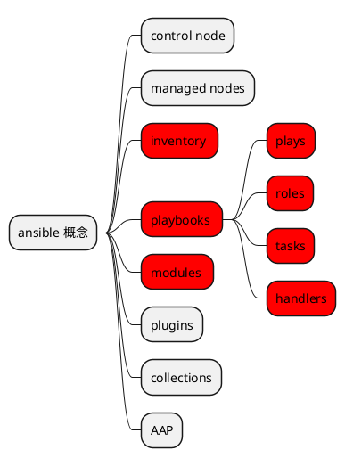

# [概念][1]

## control node
控制节点，很好理解，就是安装并运行ansible的节点。这是个逻辑概念，因为通常情况下控制节点会同时作为 managed node使用。

## managed nodes
被管理的节点，也就是被控节点，或者目标节点。

## inventory
这个概念很抽象，不能很好理解。描述的是被控节点的集合，可以对被控节点进行分组，后续自动化任务可作用在整个组上。表现形式inventory.yaml或hosts，两者格式不一样，可以平替。这对新手就很不友好，既然整出了自己的概念，为什么又要搞一个hosts格式，这个hosts并没有帮助更好理解，反而让人更困惑。
要了解有关清单的更多信息，请参阅[使用清单部分][2]。

## playbooks
剧本，核心概念，ansible执行的基本单元。定义对被控节点要进行的操作。它下面还有几个子概念。表现形式上就是site.yaml或playbooks.yaml，一个文件就是一个剧本，通过`ansible-playbook`命令执行剧本。实际上文件名可以是任何名字，不过官方示例是site.yaml。
关于剧本的更多内容，可以看[剧本简介][3]。

### plays
戏剧，剧本中的最小单元，一个剧本中可能包含一个或多个戏剧。

### roles
角色，这也是个乍一看不好理解的概念，特别抽象。它是一些内容的集合，这些内容包括任务、处理器、变量、插件、模板和文件等。它其实就是为了方便在戏剧中进行复用定义的概念，主要就是导入到戏剧中使用。所以一个角色可以很小只包含一个变量，也可以比较大包含多个任务很多变量和模板文件。唯一清晰的是它是根据文件结构来组织的，这点可以通过官方示例代码看到。

### tasks
任务，也就是真正要执行的操作了，一个戏剧中可能包含一个或多个任务。
特别的是，任务可以通过`ansible`命令直接运行，可以方便测试。

### handlers
处理器，任务的一种特殊形式。只有在一种场景下使用，那就是某个任务T通知处理器时，并且T本身的执行结果必须是‘changed’。

## modules
模块，核心概念，定义了各种各样的操作，可以对标类库概念。在任务中定义使用什么模块完成什么动作。
关于模块的更多内容，可以看[模块列表][4]。

## plugins
插件，和模块比较像的概念。可以定义怎么连接被控节点（连接插件），如何操作数据（过滤插件），或者怎么显示控制台内容（回调插件）。

## collections
为了内容分发而定义的概念，可以对标docker hub来理解，就是将自己定义好的一些戏剧、模块或者插件分享出去给别人使用。

## AAP
“Ansible Automation Platform”的缩写，企业级功能。

## 官方示例
通过[官方代码示例][5]更好的理解概念。

[1]: https://docs.ansible.com/ansible/6/user_guide/basic_concepts.html
[2]: https://docs.ansible.com/ansible/6/user_guide/intro_inventory.html#intro-inventory
[3]: https://docs.ansible.com/ansible/6/user_guide/playbooks_intro.html#about-playbooks
[4]: https://docs.ansible.com/ansible/6/collections/index.html#list-of-collections
[5]: https://github.com/ansible/ansible-examples
