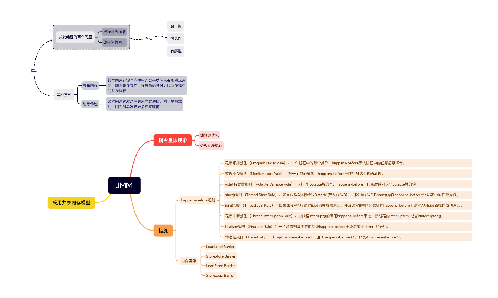

# 并发编程

```plantuml
@startmindmap
* 并发编程
    * 基础概念
        * 原子性
        * 可见性
        * 有序性
        * Java内存模型
        * 指令重排序
        * 内存屏障
        * happens-before
    * 线程池
    * 锁
@endmindmap
```

## 基础概念

原子性：一个或多个操作全部完成或全部失败。
可见性：多个线程操作同一个共享变量，其中一个线程对共享变量的修改其他线程看不见，因此需要方法让其他线程立刻感知。
有序性：程序执行顺序按照代码顺序

指令重排序发生在什么时候？
编译器优化；运行期CPU指令流水线技术导致的乱序执行；

内存屏障的原理是什么？
内存屏障是一个抽象概念，不同的CPU架构提供了不同的指令实现。JMM将内存屏障分为四类，会屏蔽CPU架构

volatile如何实现的？
内存屏障

## 参考
- [深入理解 Java 内存模型_程晓明_InfoQ.pdf](https://github.com/zxiaofan/JavaBooks/blob/master/%E6%B7%B1%E5%85%A5%E7%90%86%E8%A7%A3%20Java%20%E5%86%85%E5%AD%98%E6%A8%A1%E5%9E%8B_%E7%A8%8B%E6%99%93%E6%98%8E_InfoQ.pdf)
- [Java内存模型(Java Memory Model，JMM)](https://cloud.tencent.com/developer/article/1906257)
- [谈谈指令重排](https://zhuanlan.zhihu.com/p/271701839)