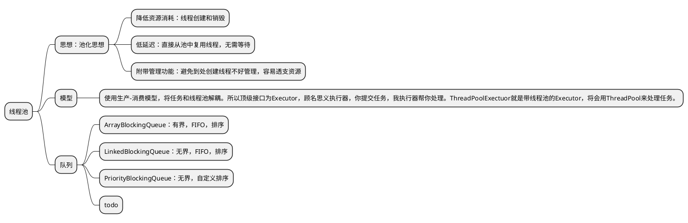

# 线程池

```plantuml
@startmindmap
* 线程池
    * 思想：池化思想
        * 降低资源消耗：线程创建和销毁
        * 低延迟：直接从池中复用线程，无需等待
        * 附带管理功能：避免到处创建线程不好管理，容易透支资源
    * 模型
        * 使用生产-消费模型，将任务和线程池解耦。所以顶级接口为Executor，顾名思义执行器，你提交任务，我执行器帮你处理。ThreadPoolExectuor就是带线程池的Executor，将会用ThreadPool来处理任务。
    * 队列
        * ArrayBlockingQueue：有界，FIFO，排序
        * LinkedBlockingQueue：无界，FIFO，排序
        * PriorityBlockingQueue：无界，自定义排序
        * todo
@endmindmap
```
