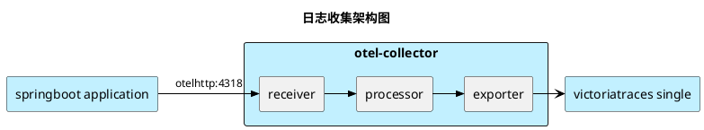

# OpenTelemetry 入门
## 架构



## 接入方式
### javaagent 插桩

```Dockerfile
FROM eclipse-temurin:17-jdk AS builder

WORKDIR /usr/src/app/

COPY ./src/ ./src/
COPY ./.mvn/ ./.mvn/
COPY ./mvnw ./pom.xml ./
RUN ./mvnw clean package -DskipTests

FROM eclipse-temurin:17-jdk

ARG OTEL_JAVA_AGENT_VERSION=2.21.0

WORKDIR /usr/src/app/

COPY --from=builder /usr/src/app/target/untitled-0.0.1-SNAPSHOT.jar ./app.jar
ADD --chmod=644 https://github.com/open-telemetry/opentelemetry-java-instrumentation/releases/download/v$OTEL_JAVA_AGENT_VERSION/opentelemetry-javaagent.jar /usr/src/app/opentelemetry-javaagent.jar
ENV JAVA_TOOL_OPTIONS=-javaagent:/usr/src/app/opentelemetry-javaagent.jar

EXPOSE 8080
ENTRYPOINT ["java","-jar","/usr/src/app/app.jar"]
```

```yml
apiVersion: apps/v1
kind: Deployment
metadata:
  name: springboot-demo
  labels:
    app.kubernetes.io/name: springboot-demo
    app.kubernetes.io/version: 0.0.1-SNAPSHOT
    app.kubernetes.io/component: springboot-demo
    app.kubernetes.io/part-of: opentelemetry-demo
spec:
  replicas: 1
  selector:
    matchLabels:
      app.kubernetes.io/name: springboot-demo
  template:
    metadata:
      name: springboot-demo
      labels:
        app.kubernetes.io/name: springboot-demo
        app.kubernetes.io/component: springboot-demo
    spec:
      containers:
        - name: springboot-demo
          image: springboot-demo:0.0.1-SNAPSHOT
          imagePullPolicy: IfNotPresent
          env:
            - name: OTEL_SERVICE_NAME
              valueFrom:
                fieldRef:
                  fieldPath: metadata.labels['app.kubernetes.io/component']
            - name: OTEL_METRICS_EXPORTER
              value: logging
            - name: OTEL_LOGS_EXPORTER
              value: otlp
            - name: OTEL_TRACES_EXPORTER
              value: otlp
            - name: OTEL_EXPORTER_OTLP_ENDPOINT
              value: http://otel-collector:4318
          ports:
            - containerPort: 8080
              protocol: TCP
      restartPolicy: Always
      
```

## 参考文献
- [Java 示例](https://opentelemetry.io/zh/docs/languages/java/getting-started/)
