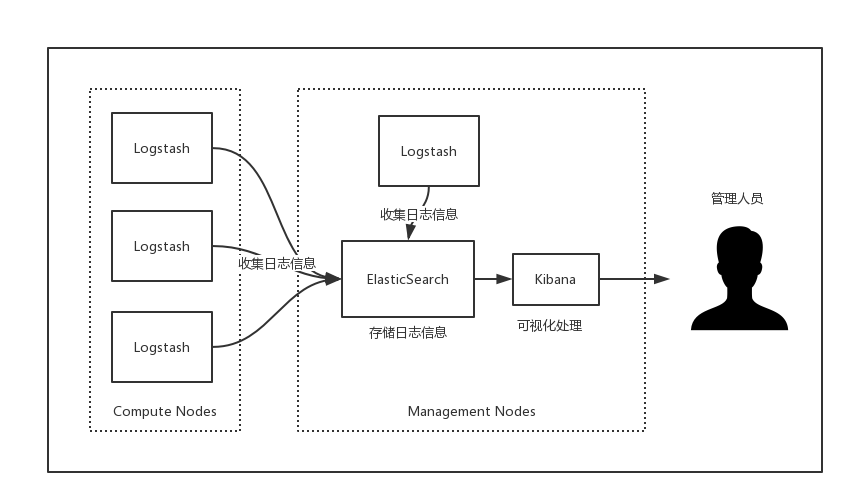

# 初探ELK日志管理体系

> ## ELK介绍

[ElasticSearch]:https://www.elastic.co/products/elasticsearch
[Beats]:https://www.elastic.co/cn/products/beats
[Logstash]:https://www.elastic.co/cn/products/logstash
[Kibana]:https://www.elastic.co/cn/products/kibana
ELK是elastic公司提供的一套完整的日志收集和展示的解决方案，分别指代的是[ElasticSearch]、[Logstash]和[Kibana]三个产品，另外加入了[Beats]来优化Logstash（这一点此处先忽略不计）。主要用于大型`分布式`系统的日志集中分析。
<!-- more -->

一个完整的集中式日志系统，需要包含以下几个主要特点：

* 收集——能够采集多种来源的日志数据
* 传输——能够稳定的把日志数据传输到中央系统
* 转换——能够对收集的日志数据进行格式转换处理
* 存储——如何存储日志数据
* 分析——可以支持UI分析
* 告警——能够提供错误报告，监控机制

在ELK体系中L负责收集、转换和传输；E负责存储数据；K负责分析，以提供可视化界面。

> ## ELK架构

一个典型的架构方式如图所示。在一个分布式的项目中为每个节点都安装Logstash来收集各自的日志信息，并将这些日志信息发送到中央ElasticSearch存储，管理人员可以通过Kibana查看可视化的结果，包括以图表的形式展示。

> ## 快速搭建

首先要了解ELK中的三个组件各自的入门使用，这一点可以参考官网的文档资料。在官网的文档中同时提供了用于操作的模拟数据，非常的贴心。另外允许的话也可以在自己本地电脑找一份tomcat的运行日志，用做模拟数据。
 
1. ElasticSearch
2. Logstash
3. Kibana