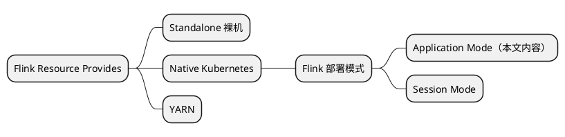

# Flink on k8s with application mode

native k8s 作为资源提供者的 Application Mode，可细分为使用 FLINK_HOME/bin/flink run-application 方式，和 flink-kubernetes-operator 方式，后者是官方主推的未来的方向。

## 提前创建 namespace
```Shell
# 创建namespace
kubectl create ns flink
# 创建serviceaccount
kubectl create serviceaccount flink-service-account -n flink
# 用户授权
kubectl create clusterrolebinding flink-role-binding-flink --clusterrole=edit --serviceaccount=flink:flink-service-account
```

## flink-kubernetes-operator
### 前提
kubectl create -f https://github.com/jetstack/cert-manager/releases/download/v1.8.2/cert-manager.

### 安装
```Shell
# 添加仓库
helm repo add flink-operator-repo https://downloads.apache.org/flink/flink-kubernetes-operator-1.4.0/
# 安装到指定 namespace
helm install flink-kubernetes-operator flink-operator-repo/flink-kubernetes-operator --namespace flink --create-namespace --set image.repository=apache/flink-kubernetes-operator
```

## 提交任务
```Shell
# 示例任务
kubectl create -f https://raw.githubusercontent.com/apache/flink-kubernetes-operator/release-1.4/examples/basic.yaml
# Flink web ui
kubectl port-forward svc/basic-example-rest 8081

# 清理任务
kubectl delete flinkdeployment/basic-example
```

## 其他问题

- 使用 Minikube 的话，由于在容器里，port-forward 宿主机无法访问
```Shell
# --address 接受所有流量
kubectl port-forward --address 0.0.0.0 pod/nginx 80:80
```

- 删除命名空间卡住
```Shell
# 可以查看空间下还有什么资源
kubectl api-resources --verbs=list --namespaced -o name | xargs -n 1 kubectl get --show-kind --ignore-not-found -n <namespace>
# 查看是namespace 卡Terminating的原因
kubectl get namespace <namespace> -o yaml
```

参考：
[删除namespace为什么会Terminating？](https://cloud.tencent.com/developer/article/1802531)

## 引用

- [flink-kubernetes-operator Quick Start](https://nightlies.apache.org/flink/flink-kubernetes-operator-docs-release-1.4/docs/try-flink-kubernetes-operator/quick-start/) 官方demo
- [Flink On K8s实践](https://www.zhihu.com/people/0700360208/posts) 文章和视频资料比较系统，质量高
- [【云原生】Flink on k8s 讲解与实战操作](https://www.cnblogs.com/liugp/p/16755095.html#4application%E6%A8%A1%E5%BC%8F%E6%8E%A8%E8%8D%90) 选读

## 扩展阅读
[Native Flink on Kubernetes 在小红书的实践](https://developer.aliyun.com/article/913111)
[【Flink on k8s】Native Kubernetes Application 部署模式详解](https://www.jianshu.com/p/66054038b9ac)