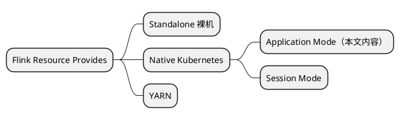

# Flink on native k8s

在 Application Mode，可以使用命令行提交（FLINK_HOME/bin/flink run-application），和 flink-kubernetes-operator 方式，后者是官方主推的未来的方向。

## 前提
文本将在k8s集群上部署一套flink application模式环境。

- 3节点k8s集群已存在
- flink任务提交采用operator方式
- flink web访问通过ingress
- flink日志、检查点、历史记录等需要用到存储卷，采用juicefs+redis+minio的方案

### chart源
```shell
helm repo add flink-operator-repo https://downloads.apache.org/flink/flink-kubernetes-operator-1.5.0/
helm repo add ingress-nginx https://kubernetes.github.io/ingress-nginx
helm repo add juicefs https://juicedata.github.io/charts/
# redis、minio
helm repo add bitnami https://charts.bitnami.com/bitnami
```

### 镜像概览
| 软件 | 镜像 |
|---|---|
| juicefs-csi-driver | juicedata/juicefs-csi-driver:v0.19.0<br/>juicedata/mount:ce-v1.0.4<br/>quay.io/k8scsi/csi-node-driver-registrar:v2.1.0<br/>quay.io/k8scsi/csi-provisioner:v1.6.0<br/>quay.io/k8scsi/livenessprobe:v1.1.0 |
| minio | bitnami/minio:2023.7.18-debian-11-r0 |
| redis | bitnami/redis:7.0.12-debian-11-r15<br/>bitnami/redis-sentinel:7.0.12-debian-11-r13 |
| flink-kubernetes-operator | quay.io/jetstack/cert-manager-controller:v1.8.2<br/>quay.io/jetstack/cert-manager-cainjector:v1.8.2<br/>quay.io/jetstack/cert-manager-webhook:v1.8.2<br/><br/>apache/flink-kubernetes-operator:be07be7 |
| ingress-nginx | registry.k8s.io/ingress-nginx/controller:v1.8.1<br/>registry.k8s.io/ingress-nginx/kube-webhook-certgen:v20230407 |

## 部署
### 部署flink-kubernetes-operator
```shell
# 前提
kubectl create -f https://github.com/jetstack/cert-manager/releases/download/v1.8.2/cert-manager.yaml

# 安装
helm install flink-kubernetes-operator flink-operator-repo/flink-kubernetes-operator \
  --version 1.5.0 \
  --namespace flink --create-namespace \
  --set image.repository=apache/flink-kubernetes-operator
```

### 部署ingress-nginx
```shell
# 安装
helm install ingress-nginx ingress-nginx/ingress-nginx \
  --version 4.7.1 \
  --namespace ingress-nginx --create-namespace \
  --set controller.image.digest='' \
  --set controller.admissionWebhooks.patch.image.digest='' \
  --set controller.service.type=NodePort \
  --set controller.hostNetwork=true \
  --set controller.replicaCount=1
```
> Tips：
> 1.controller.service.type 默认是LB，因为没有所以改成NodePort
> 2.默认镜像名是带digest的，可能会导致拉取不到镜像。

到这里就可以提交一个flink官方示例中的状态机任务，来进行阶段性验证了。

### 部署redis
```shell
# 创建redis的local-storage
kubectl apply -f local-storage-redis.yaml

# 安装
helm install redis bitnami/redis \
  --version 17.14.3 --namespace redis --create-namespace \
  --set auth.enabled=false,auth.sentinel=false \
  --set global.storageClass=local-storage-redis \
  --set replica.persistence.size=2Gi \
  --set sentinel.enabled=true,sentinel.quorum=2
```

### 部署minio
```shell
# 创建redis的local-storage
kubectl apply -f local-storage-minio.yaml

# 安装
helm install minio bitnami/minio \
  --version 12.6.10 --namespace minio --create-namespace \
  --set auth.rootUser=minioadmin,auth.rootPassword=minioadmin \
  --set mode=distributed,statefulset.replicaCount=3,statefulset.drivesPerNode=2 \
  --set persistence.storageClass=local-storage-minio,persistence.size=20Gi \
  --set service.type=NodePort
```
> 官方提供了最新的operator方式，可以试试

### 部署juicefs-csi-driver
```shell
# 安装
helm install juicefs-csi-driver juicefs/juicefs-csi-driver -f ./custom-values.yaml \
  --version 0.15.1 \
  --namespace juicefs --create-namespace
```

### 部署flink historyserver
```shell
# 创建history pvc
kubectl apply -f flink-historyserver-pvc.yaml

# 创建history configmap
kubectl apply -f flink-historyserver-conf.yaml

# 创建historyserver deployment
kubectl apply -f flink-historyserver.yaml
```

## 提交任务
```shell
# 提交任务
kubectl apply -f flink-application-deployment.yaml
```

## 问题记录
- helm安装时卡很久然后失败
部分chart仓库可能在github上，所以会下载不下来，需要手动下载，然后通过本地chart包方式安装

- 使用 Minikube 的话，由于在容器里，port-forward 宿主机无法访问
```Shell
# --address 接受所有流量
kubectl port-forward --address 0.0.0.0 pod/nginx 80:80
```

## 常用命令
```shell
# 声明某个sc为默认sc
kubectl patch storageclass juicefs-sc -p '{"metadata":{"annotations":{"storageclass.kubernetes.io/is-default-class":"true"}}}'
```

## 引用
- [flink-kubernetes-operator Quick Start](https://nightlies.apache.org/flink/flink-kubernetes-operator-docs-release-1.4/docs/try-flink-kubernetes-operator/quick-start/) 官方demo
- [Flink On K8s实践](https://www.zhihu.com/people/0700360208/posts) 文章和视频资料比较系统，质量高
- [【云原生】Flink on k8s 讲解与实战操作](https://www.cnblogs.com/liugp/p/16755095.html#4application%E6%A8%A1%E5%BC%8F%E6%8E%A8%E8%8D%90) 选读

## 扩展阅读
[Native Flink on Kubernetes 在小红书的实践](https://developer.aliyun.com/article/913111)
[【Flink on k8s】Native Kubernetes Application 部署模式详解](https://www.jianshu.com/p/66054038b9ac)

## 附录
### local-storage-redis.yaml
```yaml local-storage-redis.yaml
apiVersion: storage.k8s.io/v1
kind: StorageClass
metadata:
  name: local-storage-redis
provisioner: kubernetes.io/no-provisioner
volumeBindingMode: WaitForFirstConsumer
---
apiVersion: v1
kind: PersistentVolume
metadata:
  name: redis-local-pv-0
spec:
  capacity:
    storage: 2Gi
  volumeMode: Filesystem
  accessModes:
  - ReadWriteOnce
  persistentVolumeReclaimPolicy: Delete
  storageClassName: local-storage-redis
  local:
    path: /data/redis
  nodeAffinity:
    required:
      nodeSelectorTerms:
      - matchExpressions:
        - key: kubernetes.io/hostname
          operator: In
          values:
          - master1
---
apiVersion: v1
kind: PersistentVolume
metadata:
  name: redis-local-pv-1
spec:
  capacity:
    storage: 2Gi
  volumeMode: Filesystem
  accessModes:
  - ReadWriteOnce
  persistentVolumeReclaimPolicy: Delete
  storageClassName: local-storage-redis
  local:
    path: /data/redis
  nodeAffinity:
    required:
      nodeSelectorTerms:
      - matchExpressions:
        - key: kubernetes.io/hostname
          operator: In
          values:
          - node1
---
apiVersion: v1
kind: PersistentVolume
metadata:
  name: redis-local-pv-2
spec:
  capacity:
    storage: 2Gi
  volumeMode: Filesystem
  accessModes:
  - ReadWriteOnce
  persistentVolumeReclaimPolicy: Delete
  storageClassName: local-storage-redis
  local:
    path: /data/redis
  nodeAffinity:
    required:
      nodeSelectorTerms:
      - matchExpressions:
        - key: kubernetes.io/hostname
          operator: In
          values:
          - node2
```

### local-storage-minio.yaml
```yaml local-storage-minio.yaml
apiVersion: storage.k8s.io/v1
kind: StorageClass
metadata:
  name: local-storage-minio
provisioner: kubernetes.io/no-provisioner
volumeBindingMode: WaitForFirstConsumer
---
apiVersion: v1
kind: PersistentVolume
metadata:
  name: minio-local-pv-0
spec:
  capacity:
    storage: 20Gi
  volumeMode: Filesystem
  accessModes:
  - ReadWriteOnce
  persistentVolumeReclaimPolicy: Delete
  storageClassName: local-storage-minio
  local:
    path: /data/minio1
  nodeAffinity:
    required:
      nodeSelectorTerms:
      - matchExpressions:
        - key: kubernetes.io/hostname
          operator: In
          values:
          - master1
---
apiVersion: v1
kind: PersistentVolume
metadata:
  name: minio-local-pv-1
spec:
  capacity:
    storage: 20Gi
  volumeMode: Filesystem
  accessModes:
  - ReadWriteOnce
  persistentVolumeReclaimPolicy: Delete
  storageClassName: local-storage-minio
  local:
    path: /data/minio2
  nodeAffinity:
    required:
      nodeSelectorTerms:
      - matchExpressions:
        - key: kubernetes.io/hostname
          operator: In
          values:
          - master1
---
apiVersion: v1
kind: PersistentVolume
metadata:
  name: minio-local-pv-2
spec:
  capacity:
    storage: 20Gi
  volumeMode: Filesystem
  accessModes:
  - ReadWriteOnce
  persistentVolumeReclaimPolicy: Delete
  storageClassName: local-storage-minio
  local:
    path: /data/minio1
  nodeAffinity:
    required:
      nodeSelectorTerms:
      - matchExpressions:
        - key: kubernetes.io/hostname
          operator: In
          values:
          - node1
---
apiVersion: v1
kind: PersistentVolume
metadata:
  name: minio-local-pv-3
spec:
  capacity:
    storage: 20Gi
  volumeMode: Filesystem
  accessModes:
  - ReadWriteOnce
  persistentVolumeReclaimPolicy: Delete
  storageClassName: local-storage-minio
  local:
    path: /data/minio2
  nodeAffinity:
    required:
      nodeSelectorTerms:
      - matchExpressions:
        - key: kubernetes.io/hostname
          operator: In
          values:
          - node1
---
apiVersion: v1
kind: PersistentVolume
metadata:
  name: minio-local-pv-4
spec:
  capacity:
    storage: 20Gi
  volumeMode: Filesystem
  accessModes:
  - ReadWriteOnce
  persistentVolumeReclaimPolicy: Delete
  storageClassName: local-storage-minio
  local:
    path: /data/minio1
  nodeAffinity:
    required:
      nodeSelectorTerms:
      - matchExpressions:
        - key: kubernetes.io/hostname
          operator: In
          values:
          - node2
---
apiVersion: v1
kind: PersistentVolume
metadata:
  name: minio-local-pv-5
spec:
  capacity:
    storage: 20Gi
  volumeMode: Filesystem
  accessModes:
  - ReadWriteOnce
  persistentVolumeReclaimPolicy: Delete
  storageClassName: local-storage-minio
  local:
    path: /data/minio2
  nodeAffinity:
    required:
      nodeSelectorTerms:
      - matchExpressions:
        - key: kubernetes.io/hostname
          operator: In
          values:
          - node2

```

### juicefs-csi-driver
```yaml custom-values.yaml
# helm代为创建sc，也可以自己手动创建
storageClasses:
- name: juicefs-sc
  enabled: true
  reclaimPolicy: Delete
  annotations:
    storageclass.kubernetes.io/is-default-class: "true"
  # JuiceFS 文件系统认证信息
  # 如果已经提前创建好文件系统，则只需填写 `name` 和 `metaurl` 这两项
  backend:
    name: "myjuicefs"
    metaurl: redis://mymaster,redis.redis.svc.cluster.local:26379/0
    # metaurl: "redis://redis.redis.svc.cluster.local:6379/0"
    storage: "minio"
    accessKey: "minioadmin"
    secretKey: "minioadmin"
    bucket: "http://minio.minio.svc.cluster.local:9000/myjfs"
    # 设置 Mount Pod 时区，默认为 UTC。
    envs: "{TZ: Asia/Shanghai}"
  # Mount pod 的资源配置
  mountPod:
    resources:
      requests:
        cpu: 50m
        memory: "64Mi"
      limits:
        cpu: 100m
        memory: "256Mi"
```

### flink-historyserver
```yaml flink-historyserver-pvc.yaml
apiVersion: v1
kind: PersistentVolumeClaim
metadata:
  name: flink-historyserver-pvc  # jar pvc名称
  namespace: flink-etl
spec:
  storageClassName: juicefs-sc   #sc名称
  accessModes:
    - ReadWriteMany   #采用ReadOnlyMany的访问模式
  resources:
    requests:
      storage: 5Gi    #存储容量，根据实际需要更改
```

```yaml flink-historyserver-conf.yaml
kind: ConfigMap
apiVersion: v1
metadata:
  name: flink-historyserver-conf
  namespace: flink-etl
  annotations:
    kubesphere.io/creator: admin
data:
  flink-conf.yaml: |
    blob.server.port: 6124
    kubernetes.jobmanager.annotations: flinkdeployment.flink.apache.org/generation:2
    kubernetes.jobmanager.replicas: 1
    kubernetes.jobmanager.cpu: 100m
    $internal.flink.version: v1_16
    kubernetes.taskmanager.cpu: 100m
    jobmanager.rpc.port: 6123
    taskmanager.rpc.port: 6122
    kubernetes.service-account: flink
    kubernetes.cluster-id: flink-historyserver
    kubernetes.container.image: flink:1.16.0-scala_2.12-java11
    parallelism.default: 1
    kubernetes.namespace: flink-etl
    taskmanager.numberOfTaskSlots: 3
    kubernetes.rest-service.exposed.type: ClusterIP
    kubernetes.operator.reconcile.interval: 15 s
    kubernetes.operator.metrics.reporter.slf4j.interval: 5 MINUTE
    kubernetes.operator.metrics.reporter.slf4j.factory.class: org.apache.flink.metrics.slf4j.Slf4jReporterFactory
    jobmanager.memory.process.size: 1024m
    taskmanager.memory.process.size: 1024m
    kubernetes.internal.jobmanager.entrypoint.class: org.apache.flink.kubernetes.entrypoint.KubernetesSessionClusterEntrypoint
    kubernetes.pod-template-file: /tmp/flink_op_generated_podTemplate_17272077926352838674.yaml
    execution.target: kubernetes-session
    jobmanager.archive.fs.dir: file:///opt/flink/flink_history
    historyserver.archive.fs.dir: file:///opt/flink/flink_history
    historyserver.archive.fs.refresh-interval: 10000
    historyserver.web.port: 8082
    web.tmpdir: /opt/flink/webupload
    web.upload.dir: /opt/flink/webupload
    web.cancel.enable: false
    internal.cluster.execution-mode: NORMAL
    queryable-state.proxy.ports: 6125
    state.checkpoints.dir: file:///opt/flink/checkpoints
  log4j.properties: |
    # Allows this configuration to be modified at runtime. The file will be checked every 30 seconds.
    monitorInterval=30
    # This affects logging for both user code and Flink
    rootLogger.level = INFO
    rootLogger.appenderRef.file.ref = MainAppender
    # Uncomment this if you want to _only_ change Flink's logging
    #logger.flink.name = org.apache.flink
    #logger.flink.level = INFO
    # The following lines keep the log level of common libraries/connectors on
    # log level INFO. The root logger does not override this. You have to manually
    # change the log levels here.
    logger.akka.name = akka
    logger.akka.level = INFO
    logger.kafka.name= org.apache.kafka
    logger.kafka.level = INFO
    logger.hadoop.name = org.apache.hadoop
    logger.hadoop.level = INFO
    logger.zookeeper.name = org.apache.zookeeper
    logger.zookeeper.level = INFO
    logger.shaded_zookeeper.name = org.apache.flink.shaded.zookeeper3
    logger.shaded_zookeeper.level = INFO
    # Log all infos in the given file
    appender.main.name = MainAppender
    appender.main.type = RollingFile
    appender.main.append = true
    appender.main.fileName = ${sys:log.file}
    appender.main.filePattern = ${sys:log.file}.%i
    appender.main.layout.type = PatternLayout
    appender.main.layout.pattern = %d{yyyy-MM-dd HH:mm:ss,SSS} %-5p %-60c %x - %m%n
    appender.main.policies.type = Policies
    appender.main.policies.size.type = SizeBasedTriggeringPolicy
    appender.main.policies.size.size = 100MB
    appender.main.policies.startup.type = OnStartupTriggeringPolicy
    appender.main.strategy.type = DefaultRolloverStrategy
    appender.main.strategy.max = ${env:MAX_LOG_FILE_NUMBER:-10}
    # Suppress the irrelevant (wrong) warnings from the Netty channel handler
    logger.netty.name = org.jboss.netty.channel.DefaultChannelPipeline
    logger.netty.level = OFF
  log4j-console.properties: |
    # This affects logging for both user code and Flink
    rootLogger.level = INFO
    rootLogger.appenderRef.console.ref = ConsoleAppender
    rootLogger.appenderRef.rolling.ref = RollingFileAppender
     
    # Uncomment this if you want to _only_ change Flink's logging
    #logger.flink.name = org.apache.flink
    #logger.flink.level = INFO
     
    # The following lines keep the log level of common libraries/connectors on
    # log level INFO. The root logger does not override this. You have to manually
    # change the log levels here.
    logger.akka.name = akka
    logger.akka.level = INFO
    logger.kafka.name= org.apache.kafka
    logger.kafka.level = INFO
    logger.hadoop.name = org.apache.hadoop
    logger.hadoop.level = INFO
    logger.zookeeper.name = org.apache.zookeeper
    logger.zookeeper.level = INFO
     
    # Log all infos to the console
    appender.console.name = ConsoleAppender
    appender.console.type = CONSOLE
    appender.console.layout.type = PatternLayout
    appender.console.layout.pattern = %d{yyyy-MM-dd HH:mm:ss,SSS} %-5p %-60c %x - %m%n
     
    # Log all infos in the given rolling file
    appender.rolling.name = RollingFileAppender
    appender.rolling.type = RollingFile
    appender.rolling.append = false
    appender.rolling.fileName = ${sys:log.file}
    appender.rolling.filePattern = ${sys:log.file}.%i
    appender.rolling.layout.type = PatternLayout
    appender.rolling.layout.pattern = %d{yyyy-MM-dd HH:mm:ss,SSS} %-5p %-60c %x - %m%n
    appender.rolling.policies.type = Policies
    appender.rolling.policies.size.type = SizeBasedTriggeringPolicy
    appender.rolling.policies.size.size=100MB
    appender.rolling.strategy.type = DefaultRolloverStrategy
    appender.rolling.strategy.max = 10
     
    # Suppress the irrelevant (wrong) warnings from the Netty channel handler
    logger.netty.name = org.apache.flink.shaded.akka.org.jboss.netty.channel.DefaultChannelPipeline
    logger.netty.level = OFF
     
    # Flink Deployment Logging Overrides
    # rootLogger.level = DEBUG
```

```yaml flink-historyserver-deployment.yaml
apiVersion: apps/v1
kind: Deployment
metadata:
  namespace: flink-etl
  labels:
    app: flink-historyserver
    name: flink-historyserver
  name: flink-historyserver
spec:
  replicas: 1
  selector:
    matchLabels:
      name: flink-historyserver
  template:
    metadata:
      namespace: flink-etl
      labels:
        app: flink-historyserver
        name: flink-historyserver
    spec:
      containers:
        - name: flink-historyserver
          env:
            - name: TZ
              value: Asia/Shanghai
          image: flink:1.16.0-scala_2.12-java11
          command: [ 'sh','-c','/docker-entrypoint.sh history-server' ]
          ports:
              - containerPort: 8082
          volumeMounts:
            - name: flink-historyserver-conf
              mountPath: /opt/flink/conf/flink-conf.yaml
              subPath: flink-conf.yaml
            - name: flink-historyserver-conf
              mountPath: /opt/flink/conf/log4j.properties
              subPath: log4j.properties
            - name: flink-historyserver-conf
              mountPath: /opt/flink/conf/log4j-console.properties
              subPath: log4j-console.properties
            - name: flink-historyserver
              mountPath: /opt/flink/flink_history
      volumes:  # 挂载卷配置
        - name: flink-historyserver-conf
          configMap:
            name: flink-historyserver-conf
        - name: flink-historyserver
          persistentVolumeClaim:
            claimName: flink-historyserver-pvc
# ---
# kind: Service
# apiVersion: v1
# metadata:
#   namespace: flink
#   name: flink-historyserver
# spec:
#   type: NodePort
#   ports:
#     - port: 8082
#       nodePort: 31082
#   selector:
#     name: flink-historyserver

# ingress按实际情况配置
---
apiVersion: v1
kind: Service
metadata:
  labels:
    app: flink-historyserver
    name: flink-historyserver
  name: flink-historyserver
  namespace: flink-etl
spec:
  selector:
    app: flink-historyserver
  ports:
    - port: 8082
      protocol: TCP
      targetPort: 8082
---
apiVersion: networking.k8s.io/v1
kind: Ingress
metadata:
  namespace: flink-etl
  name: flink-historyserver
  annotations:
    nginx.ingress.kubernetes.io/default-backend: ingress-nginx-controller
    nginx.ingress.kubernetes.io/use-regex: 'true'
spec:
  ingressClassName: nginx
  rules:
    - host: "flink-hs.k8s.io"
      http:
        paths:
          - pathType: Prefix
            path: "/"
            backend:
              service:
                name: flink-historyserver
                port:
                  number: 8082
```

### flink application deployment
```yaml flink-log-pvc.yaml
apiVersion: v1
kind: PersistentVolumeClaim
metadata:
  name: flink-log-pvc
  namespace: flink-etl
spec:
  storageClassName: juicefs-sc
  accessModes:
    - ReadWriteMany   #采用ReadOnlyMany的访问模式
  resources:
    requests:
      storage: 10Gi
```

```yaml flink-application-deployment
apiVersion: flink.apache.org/v1beta1
kind: FlinkDeployment
metadata:
  namespace: flink
  name: application-flink
spec:
  image: flink:1.16.0-scala_2.12-java11
  flinkVersion: v1_16
  imagePullPolicy: IfNotPresent   # 镜像拉取策略，本地没有则从仓库拉取
  ingress:   # ingress配置，用于访问flink web页面
#    template: "flink.k8s.io/{{namespace}}/{{name}}(/|$)(.*)"
    template: "/{{namespace}}/{{name}}(/|$)(.*)"
    className: "nginx"
    annotations:
      nginx.ingress.kubernetes.io/rewrite-target: "/$2"
  flinkConfiguration:
    taskmanager.numberOfTaskSlots: "3"
    jobmanager.archive.fs.dir: file:///opt/flink/flink_history      # JobManager 归档路径
  serviceAccount: flink
  jobManager:
    replicas: 1
    resource:
      memory: "1024m"
      cpu: 1
  taskManager:
    replicas: 1
    resource:
      memory: "1024m"
      cpu: 1
  podTemplate:
    spec:
      containers:
        - name: flink-main-container
          volumeMounts:
            - name: flink-jar
              mountPath: /opt/flink/jar
            - name: flink-log
              mountPath: /opt/flink/log  
            - name: flink-historyserver
              mountPath: /opt/flink/flink_history
      volumes:
        - name: flink-jar
          persistentVolumeClaim:
            claimName: flink-jar-pvc
        - name: flink-log
          persistentVolumeClaim:
            claimName: flink-log-pvc    
        - name: flink-historyserver
          persistentVolumeClaim:
            claimName: flink-historyserver-pvc
  job:
    jarURI: local:///opt/flink/examples/streaming/StateMachineExample.jar
#    entryClass: 
    args:
      - --conf_path
      - /opt/flink/jar/1.json
      - --plugin_home
      - /opt/flink/jar/connector_plugin
    parallelism: 1
    upgradeMode: stateless
```