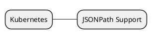

# k8s 相关

## [JSONPath Support](https://kubernetes.io/docs/reference/kubectl/jsonpath/)

## k8s java client
代码率先从 ~/.kube/config 配置文件中读取配置初始化客户端，要查看其中的内容，使用 `cat ~/.kube/config` 和 `kubectl config view` 是等价的。

[使用 Java 操作 Kubernetes API](https://developer.aliyun.com/article/888717?spm=a2c6h.12873639.article-detail.50.7800271bn2uoI9&scm=20140722.ID_community@@article@@888717._.ID_community@@article@@888717-OR_rec-V_1-RL_community@@article@@1163272#slide-1)

[最好的Kubernetes客户端Java库fabric8io，快来自定义你的操作](https://blog.csdn.net/dengnanhua/article/details/118082603)