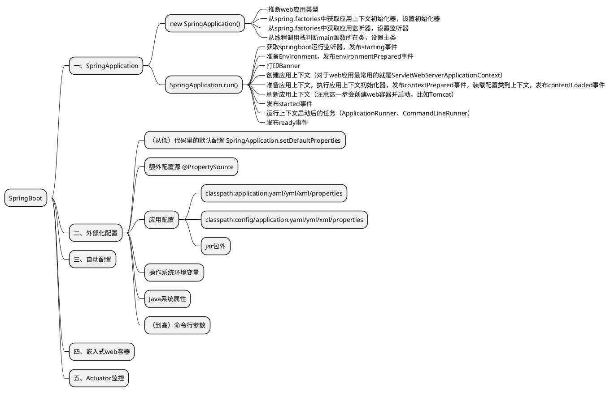
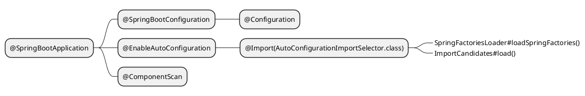

# Spring Boot




## 一、SpringApplication
## 二、外部化配置
### 配置优先级
简单的理解为每种来源的配置是一个map，将map按顺序组合成list，list前面的优先级就更高。
```java
public class MutablePropertySources implements PropertySources {

	private final List<PropertySource<?>> propertySourceList = new CopyOnWriteArrayList<>();
}
```

## 三、自动配置

### SPI
@EnableAutoConfiguration注解上的@Import(AutoConfigurationImportSelector.class)自动配置入口。通过SPI机制加载自动配置类。
SpringFactoriesLoader#loadSpringFactories()
```properties META-INF/spring.factories
...
org.springframework.boot.autoconfigure.EnableAutoConfiguration=\
org.springframework.boot.autoconfigure.admin.SpringApplicationAdminJmxAutoConfiguration,\
org.springframework.boot.autoconfigure.aop.AopAutoConfiguration,\
...
```
从v2.7.x开始调整为META-INF/spring/org.springframework.boot.autoconfigure.AutoConfiguration.imports，向后兼容

ImportCandidates.load()
```plaintext META-INF/spring/org.springframework.boot.autoconfigure.AutoConfiguration.imports
org.springframework.boot.autoconfigure.admin.SpringApplicationAdminJmxAutoConfiguration
org.springframework.boot.autoconfigure.aop.AopAutoConfiguration
...
```

### 自定义Starter

### 常用条件注解

| 注解 | 含义 | 实现 | 备注 |
|---|---|---|---|
| @ConditionalOnClass | 判断类是否存在 | @Conditional(OnClassCondition.class) 通过ClassLoader去加载类 | 反义词 @ConditionalOnMissingClass |
| @ConditionalOnBean | 判断Bean是否存在 | @Conditional(OnBeanCondition.class) 通过BeanFactory查询Bean | 反义词 @ConditionalOnMissingBean |
| @ConditionalOnSingleCandidate | 判断某个类型的Bean是否只有一个，或者有多个并且有一个是Primary | @Conditional(OnBeanCondition.class) |
| @ConditionalOnProperty | 判断属性配置 | @Conditional(OnPropertyCondition.class) 通过Environment查询属性 |
| @ConditionalOnWebApplication | 判断是不是web应用 | @Conditional(OnWebApplicationCondition.class) | 反义词 @ConditionalOnNotWebApplication |

### 属性绑定
@ConfigurationPropertiesScan
@EnableConfigurationProperties
@ConfigurationProperties

## 四、嵌入式web容器
## 五、Actuator监控
