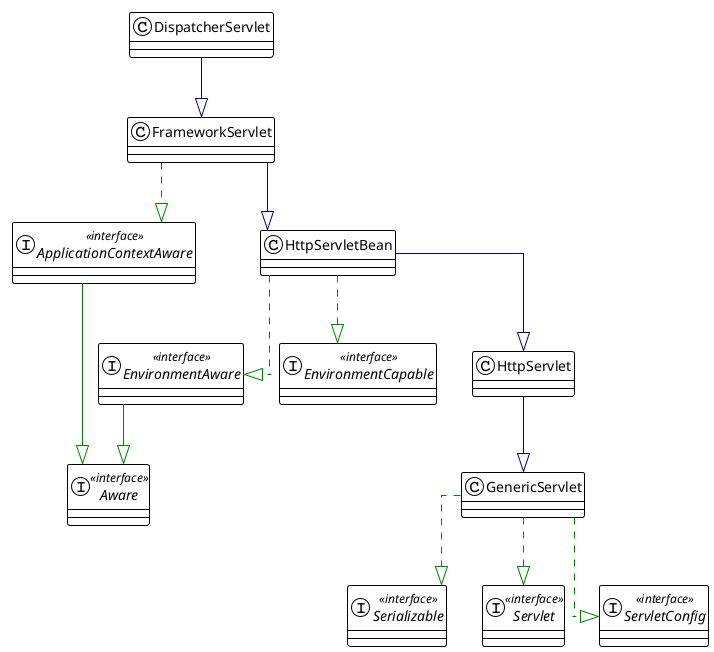
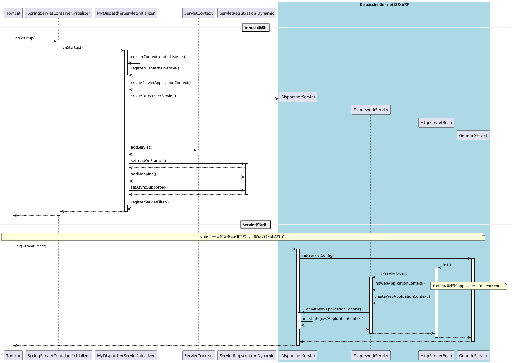
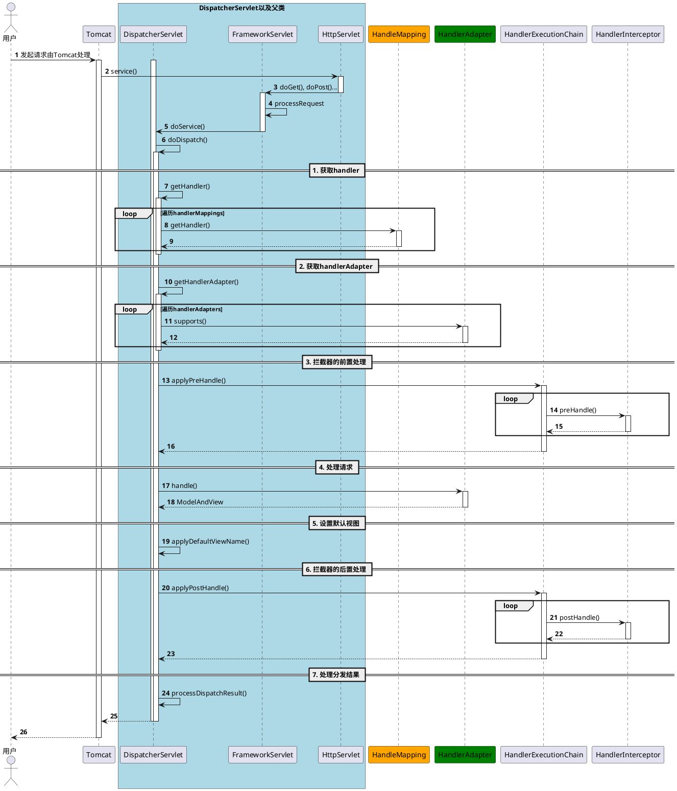

# SpringMVC
spring-mvc源码是spring-framework的一部分
## 阅读源码前置条件
- Spring版本v5.3.28
- 不使用XML，基于代码配置（AbstractAnnotationConfigDispatcherServletInitializer）
- 不使用@EnableWebMvc注解
- 安装独立Tomcat9，而不是内嵌容器

## 核心接口
| Interface | 说明 | 最常用实现类 |
|---|---|---|
| ServletContainerInitializer | Servlet容器初始化器，Servlet提供的接口，通过SPI机制初始化servlet容器，是Servlet 3.0规范，基于此Spring才能实现零配置。是tomcat和Spring之间的桥梁，也就是阅读源码的入口。 | SpringServletContainerInitializer |
| WebApplicationInitializer | web应用初始化器，回调方式配置ServletContent，注册DispatchServlet，配置应用根路径，注册过滤器，创建Spring容器等一切内容 | AbstractAnnotationConfigDispatcherServletInitializer |
| DispatcherServlet | servlet请求分发器，Spring对于servlet的核心实现，负责处理请求，会将请求分发给处理器处理，解析视图并返回客户端 |
| HandleMapping | 处理器映射，保存URL和处理器的映射关系，处理器是一个抽象概念代表能处理请求的东西，比如最常见的@RequestMapping注解的方法 | RequestMappingHandlerMapping |
| HandlerAdapter | 处理器适配器，对各种处理器进行适配。 | RequestMappingHandlerAdapter：@RequestMapping标注方法的处理器的适配器，需要适配内容包括参数处理，返回值处理 | RequestMappingHandlerAdapter |
| HandlerExecutionChain | 处理器执行链，封装处理器和拦截器 |
| HandlerMethod | 方法形式处理器，也就是@RequestMapping标注的方法，这个接口是对处理器方法的封装，便于后面使用，里面会包含方法签名，方法参数等 |
| HandlerMethodArgumentResolver | 参数解析器 | RequestParamMethodArgumentResolver：@RequestParam参数解析器 PathVariableMethodArgumentResolver：：@PathVariable参数解析器 RequestResponseBodyMethodProcessor：@RequestBody参数解析器 |
| HandlerMethodReturnValueHandler | 返回值处理器 | RequestResponseBodyMethodProcessor：@ResponseBody返回值处理器 |
| HttpMessageConverter | http消息转换器，将各种返回值处理成http消息写入http响应输出流 |
| HandlerInterceptor | 拦截器 |

## DispatcherServlet 类图

## 初始化流程
Tomcat启动后会通过SPI机制发现SpringServletContainerInitializer，然后调用SpringServletContainerInitializer.onStartup()方法。
SpringServletContainerInitializer会遍历所有的WebApplicationInitializer，这里假设我们的MyDispatcherServletInitializer extends AbstractAnnotationConfigDispatcherServletInitializer，它的作用是替代web.xml文件配置。

## 请求处理流程
### 请求处理时序图

处理流程详解：

1. 返回值处理

handlerAdapter遍历自己所有的返回值处理器，判断是否支持处理当前类型的返回值，支持则对返回值进行处理。

比如接口使用了@ResponseBody，则对应的返回值处理器就是RequestResponseBodyMethodProcessor。该处理器会找到合适的 HttpMessageConverter 将返回值写入到输出流中，默认策略会初始化四个HttpMessageConverter。

2. 
