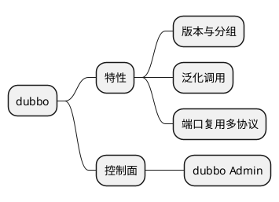

# dubbo 入门

单端口多协议支持

## springboot版本适配
dubbo-spring-boot-starter的pom里面有springboot版本
| dubbo | springboot |
|---|---|
| 3.2.11 | 2.7.18 |

## todo
内置协议实现原理Dubbo2、Triple (兼容 gRPC) 
如何扩展协议
dubbo admin服务测试功能实践
dubbo如何实现优雅上下线
多注册中心支持
