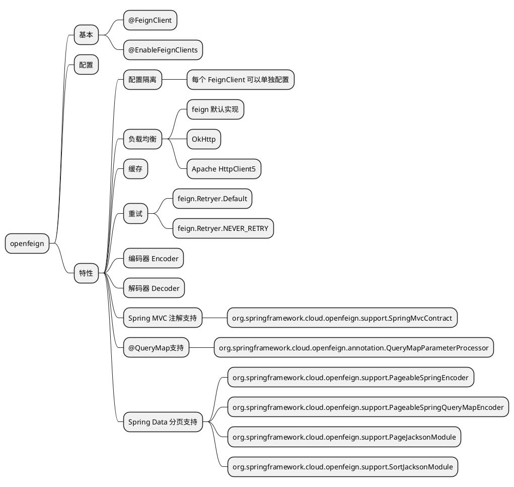

# Spring Cloud OpenFeign



## 重点注解
### @FeignClient
- value、name: 服务名，唯一，与eureka集成时也就是eureka中的服务名。
- contextId: bean名称（只有服务名的时候用服务名同时作为bean名称）
- url: 请求地址
- path: 路径前缀
- configuration: 为当前客户端指定配置
- fallback、fallbackFactory: 断路器断路之后的兜底客户端
- primary: 与fallback配合使用，标记主客户端，剩下的客户端是fallback客户端

## 特性
### 配置隔离
每个 FeignClient 都有一个属于自己的 ApplicationContext 子容器，各自的配置bean只注入到子容器中。
```java
// org.springframework.cloud.openfeign.FeignAutoConfiguration
// 主程序容器中注入 feignContext，管理所有子容器
@Bean
public FeignClientFactory feignContext() {
    FeignClientFactory context = new FeignClientFactory();
    context.setConfigurations(this.configurations);
    return context;
}

// FeignClientFactory 继承 NamedContextFactory
// org.springframework.cloud.context.named.NamedContextFactory
public abstract class NamedContextFactory<C extends NamedContextFactory.Specification>
		implements DisposableBean, ApplicationContextAware {

	private final Map<String, ApplicationContextInitializer<GenericApplicationContext>> applicationContextInitializers;

	private final String propertySourceName;

	private final String propertyName;
    // 客户端bean名称，子容器
	private final Map<String, GenericApplicationContext> contexts = new ConcurrentHashMap<>();
    // 客户端bean名称，配置
	private Map<String, C> configurations = new ConcurrentHashMap<>();
    // 主程序容器，是所有子容器的父容器
	private ApplicationContext parent;
    // 默认配置类 org.springframework.cloud.openfeign.FeignClientsConfiguration
	private Class<?> defaultConfigType;
}
```
### 重试
默认策略是不重试

```java 
// FeignClientsConfiguration
@Bean
@ConditionalOnMissingBean
public Retryer feignRetryer() {
    return Retryer.NEVER_RETRY;
}
```

可以通过配置，使用Feign实现的重试器 feign.Retryer.Default，也可以自己实现
```yaml
spring:
  cloud:
    openfeign:
      client:
        config:
          default:
            connectTimeout: 2000
            readTimeout: 3000
            loggerLevel: full
            retryer: feign.Retryer.Default
```

重试器如何工作的
```java
// feign.SynchronousMethodHandler
final class SynchronousMethodHandler implements MethodHandler {
    @Override
    public Object invoke(Object[] argv) throws Throwable {
        RequestTemplate template = buildTemplateFromArgs.create(argv);
        Options options = findOptions(argv);
        Retryer retryer = this.retryer.clone();
        while (true) {
            try {
                // 请求
                return executeAndDecode(template, options);
            } catch (RetryableException e) {
                try {
                    // 抛出重试异常，重试器工作
                    retryer.continueOrPropagate(e);
                } catch (RetryableException th) {
                    // 获取原始异常
                    Throwable cause = th.getCause();
                    // 如果异常传播策略是 UNWARP 并且原始异常不为空，抛出原始异常；否则抛出重试异常
                    if (propagationPolicy == UNWRAP && cause != null) {
                        throw cause;
                    } else {
                        throw th;
                    }
                }
                if (logLevel != Logger.Level.NONE) {
                    logger.logRetry(metadata.configKey(), logLevel);
                }
                // 下一次重试
                continue;
            }
        }
    }
}
```

