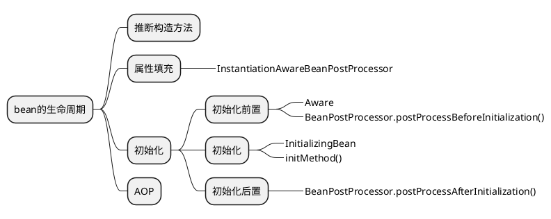
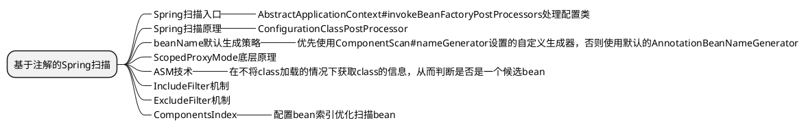

# spring
## bean的生命周期


1. Aware
1. BeanPostProcessor.postProcessBeforeInitialization()

    @PostConstruct注解方法会被封装成CommonAnnotationBeanPostProcessor，所以也属于BeanPostProcessor

2. InitializingBean
3. BeanPostProcessor.postProcessAfterInitialization()

### 常用注解
- @AutoWired
    在属性填充阶段处理，处理类是AutowiredAnnotationBeanPostProcessor

- @Resource
    处理类是CommonAnnotationBeanPostProcessor

## AOP代理

- JDK代理
- CGLIB动态代理

### Spring事务
事务是切面的应用之一，Spring会为@Transaction注解的方法增加切面逻辑如下。

1. 事务管理器获取数据库连接

    连接必须由Spring的事务管理器创建，这是前提条件

2. 将连接的autoCommit设置为false
3. 执行@Transaction注解的方法的业务逻辑
4. 事务提交或回滚

事务失效场景：
- 方法嵌套

    ```java
    ...
    @Transactional
    public void a() {
        // this.b()
        b()
    }

    @Transactional
    public void b() {
        throw new NullPointerException();
    }
    ...
    ```
    这里调用b()的对象实际是没有被代理的对象。

- 没有@Configuration
    ```java
    // @Configuration
    @EnableTransactionManagement
    public class TxConfig {

        @Bean
        public DataSource dataSource() {
            return new DriverManagerDataSource("jdbc:mysql://...", "username", "password");
        }

        @Bean
        public JdbcTemplate jdbcTemplate() {
            return new JdbcTemplate(dataSource());
        }

        @Bean
        public PlatformTransactionManager transactionManager() {
            return new DataSourceTransactionManager(dataSource());
        }
    }
    ```
    没有@Configuration会导致产生两个datasource

## 循环依赖
三级缓存解决单例bean循环依赖问题。个人认为严格上说是二级缓存和三级缓存一起解决了循环依赖问题，源码里也可以看出来，这两个缓存的操作是成对出现的并且需要加锁。

- 一级缓存singletonObjects

    经过完整生命周期的单例bean对象。

- 二级缓存earlySingletonObjects

    填充属性阶段出现循环依赖而被提前生成的bean对象，没有经历完整生命周期。

- 三级缓存singletonFactories

    打破循环依赖的关键。这个map存储的是如何提前生成bean的方法，提前生成的bean然后存到二级缓存。

题外话，其实如果没有动态代理的话，两级缓存就可以解决循环依赖问题。

## Spring扫描
