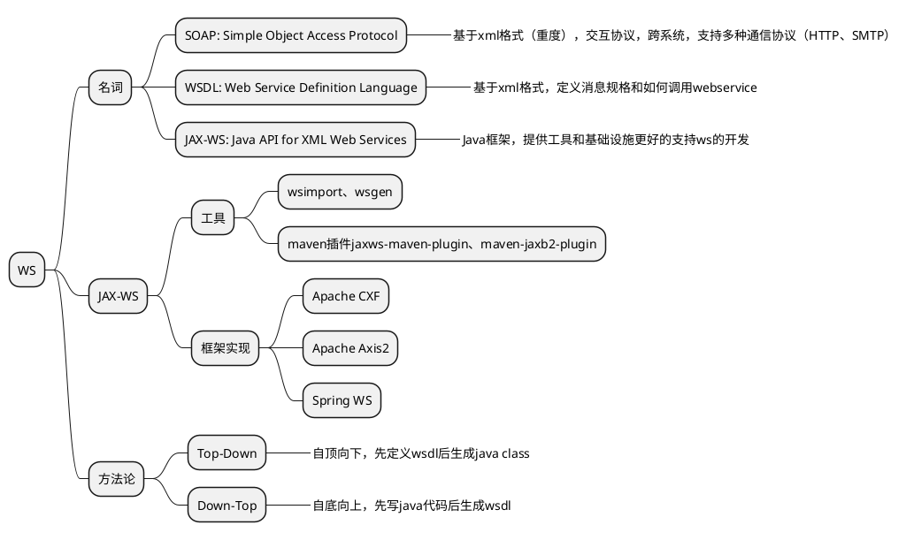

# Web Service

## WSDL 概念

Definitions

Types

Messages

PortTypes & Operations

Bindings

Services & Ports

[JAX-WS](https://eclipse-ee4j.github.io/metro-jax-ws/)
[JAX-WS baeldung介绍](https://www.baeldung.com/jax-ws)
