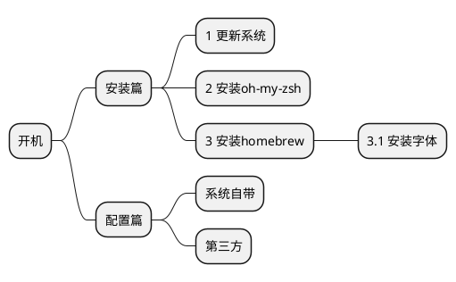
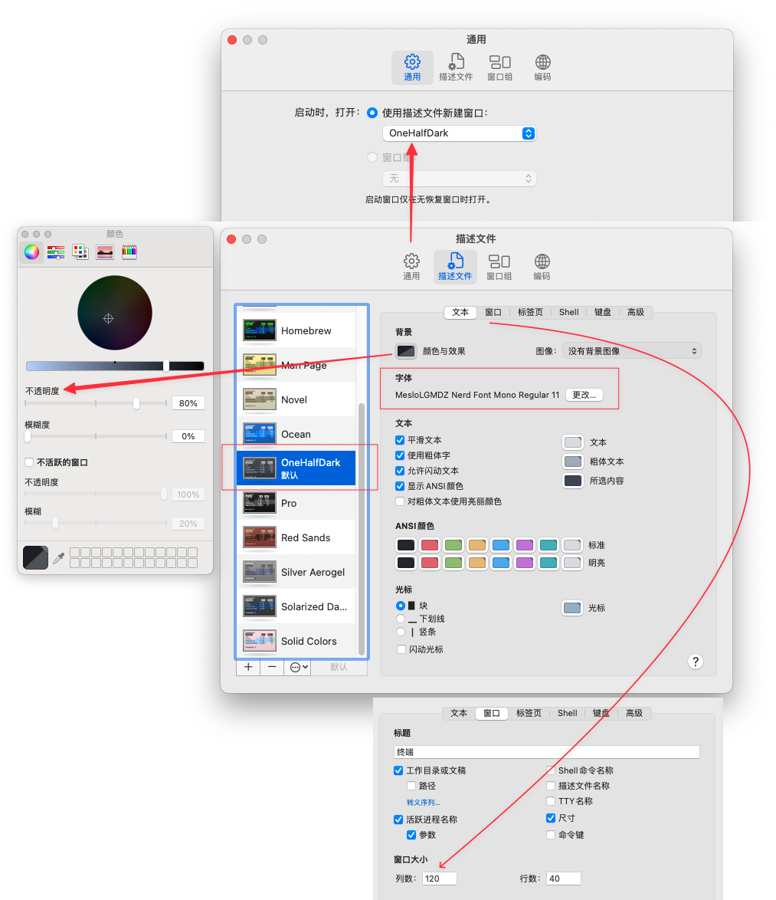

# 从零配置Mac开发环境



## 安装篇
### 更新系统
- 更新系统到最新版本
- 打开终端运行`xcode-select --install`安装开发者工具

### 安装oh-my-zsh
参考《[ohmyzsh][1]》和《[清华 ohmyzsh镜像使用帮助][2]》

```shell
# 检查zsh git
zsh --version
git --version

# 从清华镜像安装
git clone https://mirrors.tuna.tsinghua.edu.cn/git/ohmyzsh.git
cd ohmyzsh/tools
REMOTE=https://mirrors.tuna.tsinghua.edu.cn/git/ohmyzsh.git sh install.sh
cd ../../ && rm -rf ohmyzsh
```

### 安装homebrew
参考《[Homebrew][3]》和《[清华 Homebrew镜像使用帮助][4]》

```shell
# 临时设置环境变量
export HOMEBREW_INSTALL_FROM_API=1
export HOMEBREW_API_DOMAIN="https://mirrors.tuna.tsinghua.edu.cn/homebrew-bottles/api"
export HOMEBREW_BOTTLE_DOMAIN="https://mirrors.tuna.tsinghua.edu.cn/homebrew-bottles"
export HOMEBREW_BREW_GIT_REMOTE="https://mirrors.tuna.tsinghua.edu.cn/git/homebrew/brew.git"
export HOMEBREW_CORE_GIT_REMOTE="https://mirrors.tuna.tsinghua.edu.cn/git/homebrew/homebrew-core.git"

# 从清华镜像下载安装脚本并安装
git clone --depth=1 https://mirrors.tuna.tsinghua.edu.cn/git/homebrew/install.git brew-install
/bin/bash brew-install/install.sh
rm -rf brew-install

# Apple Silicon CPU设备配置，x86设备不用
test -r ~/.zprofile && echo 'eval "$(/opt/homebrew/bin/brew shellenv)"' >> ~/.zprofile

# 重新打开终端运行以下命令
echo 'export HOMEBREW_BREW_GIT_REMOTE="https://mirrors.tuna.tsinghua.edu.cn/git/homebrew/brew.git"' >> ~/.zprofile
for tap in cask{-fonts,-versions} command-not-found services; do
    brew tap --custom-remote --force-auto-update "homebrew/${tap}" "https://mirrors.tuna.tsinghua.edu.cn/git/homebrew/homebrew-${tap}.git"
done
brew update
```

### 安装字体

```shell
brew install --cask font-meslo-lg-nerd-font
```

## 配置篇
### 访达
- 设置-边栏-勾选用户文件夹
- 设置-通用-开启新“访达”窗口时打开用户文件夹
- 通过命令设置
    ```shell
    # 显示路径栏
    defaults write com.apple.finder ShowPathbar -boolean true
    # 显示隐藏文件
    defaults write com.apple.finder AppleShowAllFiles -boolean true
    # 如果没有立刻生效，杀掉访达进程会自动重启访达
    killall Finder
    ```

### 键盘
- 系统偏好设置-键盘：按键重复最快，重复前延迟最短

### QuickLook
参考《[Quick Look plugins][7]》，qlcolorcode插件Apple Silicon设备不兼容，可以用[Syntax Highlight][8]替换qlcolorcode

```shell
brew install qlcolorcode qlstephen qlmarkdown quicklook-json
```

### 终端

参考《[10 个 Terminal 主题，让你的 macOS 终端更好看][5]》

下载[OneHalfDark.terminal][6]主题配色，终端偏好设置导入描述文件并设置为默认。窗口大小120*40，不透明度80%，字体需要额外下载。



### ohmyzsh
插件：
- zsh-syntax-highlighting 命令语法高亮

```shell
# clone插件仓库
git clone https://github.com/zsh-users/zsh-syntax-highlighting.git ${ZSH_CUSTOM:-~/.oh-my-zsh/custom}/plugins/zsh-syntax-highlighting

# 修改ohmyzsh配置文件
# sed -i '' 意思是直接修改原文件不创建备份
sed -i '' 's/plugins=(/plugins=(zsh-syntax-highlighting /' ~/.zshrc
```

主题：
```shell
# 修改ohmyzsh配置文件（需要powerline字体配合）
sed -i '' 's/ZSH_THEME="robbyrussell"/ZSH_THEME="agnoster"/' ~/.zshrc
```

代理：
```shell
test ! -f ${ZSH_CUSTOM:-~/.oh-my-zsh/custom}/proxy.zsh && cat > ${ZSH_CUSTOM:-~/.oh-my-zsh/custom}/proxy.zsh <<EOF
# add alias for proxy
alias proxy='export https_proxy=http://127.0.0.1:7890 http_proxy=http://127.0.0.1:7890 all_proxy=socks5://127.0.0.1:7890'
alias unproxy='unset all_proxy http_proxy https_proxy'
EOF
```

[1]: https://github.com/ohmyzsh/ohmyzsh
[2]: https://mirrors.tuna.tsinghua.edu.cn/help/ohmyzsh.git/
[3]: https://brew.sh/
[4]: https://mirrors.tuna.tsinghua.edu.cn/help/homebrew/
[5]: https://zhuanlan.zhihu.com/p/57592979
[6]: https://github.com/mbadolato/iTerm2-Color-Schemes/blob/master/terminal/OneHalfDark.terminal
[7]: https://github.com/sindresorhus/quick-look-plugins
[8]: https://github.com/sbarex/SourceCodeSyntaxHighlight
