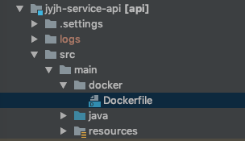
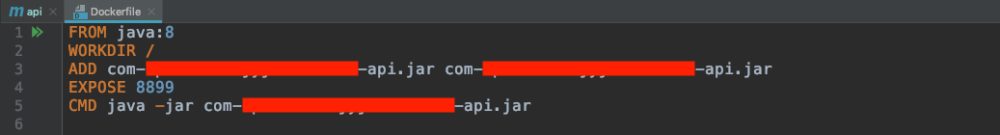

> ## 我现在在哪里

假设现在我们手上有这么一些东西：

1. 一个项目。比如公司的项目，或者你亲手写的HelloDemo
2. 一台服务器。并且惊奇的发现服务器上已经装好了Docker。还没有？？[点这里]()
3. 用IDEA打开了项目，并能够正常运行。
4. 通过相关的ssh软件连接了服务器并处于登陆状态

<!--more-->

> ## 我该怎么办

### 第一步 在工程的pom.xml文件中新增插件

第一种方式：插件中定义，而不额外增加Dockerfile文件，适合定义简单镜像，比如现在这种写demo的情况。

``` Yaml
<plugins>
    <!-- docker -->
    <plugin>
        <groupId>com.spotify</groupId>
        <artifactId>docker-maven-plugin</artifactId>
        <version>1.0.0</version>
        <executions>
            <!--执行 mvn package 时 自动 执行 mvn docker:build-->
            <execution>
                <id>build-image</id>
                <phase>package</phase>
                <goals>
                    <goal>build</goal>
                </goals>
            </execution>
        </executions>
        <configuration>
            <imageName>${docker.image.prefix}/${project.artifactId}:latest</imageName>
            <baseImage>java</baseImage>
            <entryPoint>["java","-jar","/${project.build.finalName}.jar}"]</entryPoint>
            <dockerHost> http://10.10.10.107:2375 </dockerHost>
            <!-- <dockerDirectory>src/main/docker</dockerDirectory> -->
            <resources>
                <resource>
                    <targetPath>/</targetPath>
                    <directory>${project.build.directory}</directory>
                    <include>${project.build.finalName}.jar</include>
                </resource>
            </resources>
        </configuration>
    </plugin>
```

第二种方式：通用方式，更易定制镜像

``` Yaml
<plugins>
    <!-- docker -->
    <plugin>
        <groupId>com.spotify</groupId>
        <artifactId>docker-maven-plugin</artifactId>
        <version>1.0.0</version>
        <executions>
            <!--执行 mvn package 时 自动 执行 mvn docker:build-->
            <execution>
                <id>build-image</id>
                <phase>package</phase>
                <goals>
                    <goal>build</goal>
                </goals>
            </execution>
        </executions>
        <configuration>
            <imageName>${docker.image.prefix}/${project.artifactId}:latest</imageName>
            <!-- <baseImage>java</baseImage> -->
            <!-- <entryPoint>["java","-jar","/${project.build.finalName}.jar}"]</entryPoint> -->
            <dockerHost>http://10.10.10.107:2375</dockerHost>
            <dockerDirectory>src/main/docker</dockerDirectory>
            <resources>
                <resource>
                    <targetPath>/</targetPath>
                    <directory>${project.build.directory}</directory>
                    <include>${project.build.finalName}.jar</include>
                </resource>
            </resources>
        </configuration>
    </plugin>
```

目录结构：



Dockerfile内容：



### 第二步 打开服务器上Docker的远程API

老大丢我的服务器是什么发行版？

``` bash
[root@localhost local]# cat /etc/os-release
NAME="CentOS Linux"
VERSION="7 (Core)"
ID="centos"
ID_LIKE="rhel fedora"
VERSION_ID="7"
PRETTY_NAME="CentOS Linux 7 (Core)"
```

确定发行版后，确定docker.service的位置并编辑它。

``` bash
vim /usr/lib/systemd/system/docker.service
```

部分内容如下，搜索ExecStart并在后面追加 -H tcp://0.0.0.0:2375 -H unix:///var/run/docker.sock ，是追加！原样追加！

``` bash
[Unit]
Description=Docker Application Container Engine
Documentation=https://docs.docker.com
BindsTo=containerd.service
After=network-online.target firewalld.service containerd.service
Wants=network-online.target
Requires=docker.socket

[Service]
Type=notify
# the default is not to use systemd for cgroups because the delegate issues still
# exists and systemd currently does not support the cgroup feature set required
# for containers run by docker
ExecStart=/usr/bin/dockerd -H fd:// --containerd=/run/containerd/containerd.sock -H tcp://0.0.0.0:2375 -H unix:///var/run/docker.sock
ExecReload=/bin/kill -s HUP $MAINPID
TimeoutSec=0
RestartSec=2
Restart=always

# Note that StartLimit* options were moved from "Service" to "Unit" in systemd 229.
# Both the old, and new location are accepted by systemd 229 and up, so using the old location
# to make them work for either version of systemd.
StartLimitBurst=3
```

不要忘记重启docker的守护线程和docker，查看2375端口是否被docker监听，检查2375端口是否成功对外开放

``` bash
[root@localhost local]# systemctl daemon-reload
[root@localhost local]# systemctl restart docker
[root@localhost local]# netstat -anp|grep 2375
tcp6       0      0 :::2375                 :::*                    LISTEN      9151/dockerd
[root@localhost local]# curl 127.0.0.1:2375/info
{"ID":"EVL2:VMEB:CUJ6:KL5D:AHS5:RBQU:KTTK:ZGWU:GQCO:ULZ4:6ZP2:2MYW","Containers":0,"ContainersRunning":0,"ContainersPaused":0,"ContainersStopped":0,"Images":0,"Driver":"overlay2","DriverStatus":[["Backing Filesystem","xfs"],["Supports d_type","true"],["Native Overlay Diff","true"]],"SystemStatus":null,"Plugins":{"Volume":["local"],"Network":["bridge","host","macvlan","null","overlay"],"Authorization":null,"Log":["awslogs","fluentd","gcplogs","gelf","journald","json-file","local","logentries","splunk","syslog"]},"MemoryLimit":true,"SwapLimit":true,"KernelMemory":true,"CpuCfsPeriod":true,"CpuCfsQuota":true......
```

### 第三步 增加环境变量（Windows系统选做）

Windows系统：其他文章都有这一步，需要在系统环境变量中新增Docker_HOST，值为tcp://http://服务器IP:2375。
Mac系统：本人macOS major并没有添加环境变量依然可以实现通信。猜测Windows也是可以不用的，因为pom.xml中已经写明了<dockerHost>http://10.10.10.107:2375</dockerHost>，并且IDEA是一个功能强大的编辑器。当然想法有待验证。

> ## 验证插件是否有效

1. 第一个坑

   * 报错

        执行mvn package报错：找不到docker目录

        ``` plain
        [ERROR] Failed to execute goal com.spotify:docker-maven-plugin:1.0.0:build (build-image) on project api: Exception caught: basedir src/main/docker does not exist -> [Help 1]
        [ERROR] 
        [ERROR] To see the full stack trace of the errors, re-run Maven with the -e switch.
        [ERROR] Re-run Maven using the -X switch to enable full debug logging.
        ......
        ```

   * 解决

        什么！瞎了嘛！就在那还找不到？解决办法很简单，修改pom.xml，在路径前面加上项目路径`<dockerDirectory>${project.basedir}/src/main/docker</dockerDirectory>`。来自[Stack Overflow上的解决方案](https://stackoverflow.com/questions/47308102/failed-to-execute-goal-com-spotifydocker-maven-plugin1-0-0build-exception-cau)

   * 思考：

        因为别人的文章中用的都是demo工程，而我用的是一个项目，并且没有在parent的pom里面加插件，而只用了一个api模块做测试，在模块pom中增加docker-maven插件，所以要补全路径。

    正常运行mvn package后，控制台开始走日志信息，大意是先打包成jar，然后插件工作，根据Dockerfile生成镜像发布到服务器，登陆服务器使用docker image ls命令能看到新增的镜像。

2. 第二个坑

这个坑搞了半天，不说了都是泪，估计也没有人和我一样蠢。