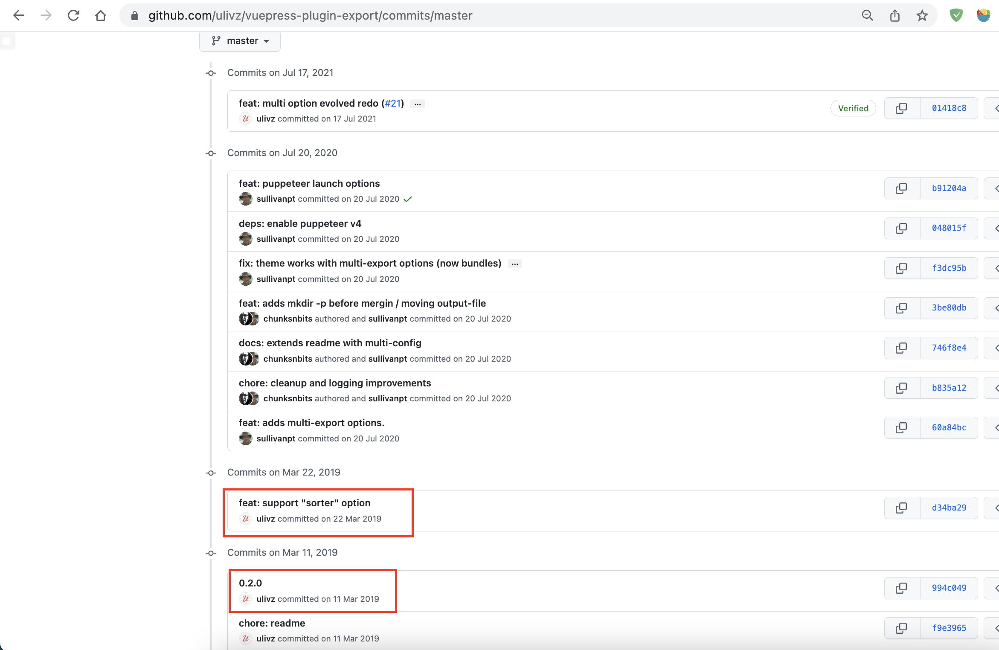

<!-- # Vuepress 站点导出PDF页面乱序 -->
## 背景

- Vuepress V1.x
- 插件 [vuepress-plugin-export@0.2.0](https://github.com/ulivz/vuepress-plugin-export/releases/tag/v0.2.0)

使用vuepress搭建了一个内部文档，因为有离线阅读和便于分发的需求，所以需要将vuepress站点导出PDF文件，使用了上面的导出插件。根据插件github上的介绍是支持对导出页面进行排序的，但是试了很久没有效果。后来查看了本地依赖包源码发现并没有相关功能代码，与github上master分支代码不一致，怀疑是版本问题。

<!-- more -->

确认git提交记录，可以发现支持sorter函数是在v0.2.0之后，后面虽然提交了很多功能，但是一直没有编译新的版本。



## 解决方案

作为前端小白，并不想自己从源码打包版本。后面在github上找到了另外一款插件[vuepress-plugin-pdf-export v1.1.0](https://github.com/SnowdogApps/vuepress-plugin-pdf-export)替代。其实在github上用“vuepress pdf“作为关键词有2页记录，其中有的插件实现的思路是根据vuepress导航栏配置来自动排序。

## vuepress-plugin-pdf-export 使用

插件支持配置一个sorter函数，作者没有给出栗子，这里提供两个思路。

- [Frontmatter](https://vuepress.vuejs.org/guide/frontmatter.html#frontmatter)

给页面添加一个排序字段，然后排序函数获取这个字段做减法，比如
``` md
---
pdfOrder: 1
---

# 首页
```

- 排序函数本身维护顺序

感觉frontmatter维护页面太麻烦了，所以直接把页面顺序定义在函数里

``` js
 module.exports = {
    // site config
    plugins: [
        ['@vuepress/plugin-back-to-top'],
        ['@snowdog/vuepress-plugin-pdf-export', {
            outputFileName: 'site.pdf',
            sorter: (page1, page2) => {
                let pageArray = [
                    '/index.md',
                    '/guide/introduction.md',
                    '/guide/getting-started.md',
                    '/guide/dependency.md',
                    '/guide/log.md',
                    '/guide/sample.md',
                    '/guide/FAQ.md',
                    '/guide/advanced.md',
                    '/about/about.md'
                ]

                let page1Path = '/' + page1.relativePath
                let page2Path = '/' + page2.relativePath

                let page1Index = pageArray.indexOf(page1Path) === -1 ? 999 : pageArray.indexOf(page1Path)
                let page2Index = pageArray.indexOf(page2Path) === -1 ? 999 : pageArray.indexOf(page2Path)

                let order = page1Index - page2Index

                // console.log(page1.title + '-' + page2.title + '=' + page1Index + '-' + page2Index + '=' + order)
                return order
            }
        }]
    ],

    // theme and its config
    theme: '@vuepress/theme-default',
    themeConfig: {
        nav: [
            {
                text: '指南',
                link: '/guide/introduction.md'
            },
            {
                text: '关于',
                link: '/about/about.md'
            }
        ],
        sidebar: {
            '/guide/': [
                '/guide/introduction.md',
                '/guide/getting-started.md',
                '/guide/dependency.md',
                '/guide/log.md',
                '/guide/sample.md',
                '/guide/FAQ.md',
                '/guide/advanced.md'
            ],
        }
    }
}
```
